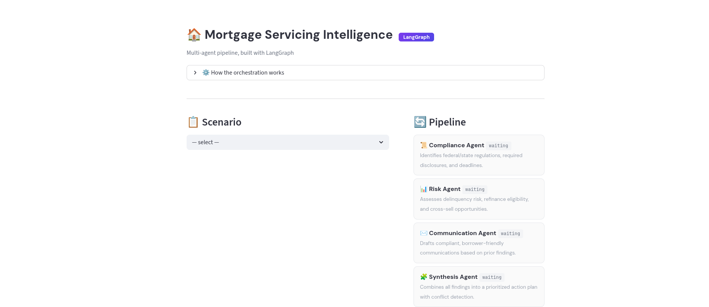

# Mortgage Servicing Intelligence

**Multi-agent LLM orchestration for mortgage servicing analysis, built with LangGraph.**

Input a mortgage scenario — forbearance, collections, loan modification — and 5 specialized AI agents produce a unified action plan with compliance analysis, risk assessment, borrower communication, and quality evaluation.


<!-- Replace with actual screenshot -->

**[Try the Live Demo →](your-streamlit-url)**

---

## Architecture

Compliance and Risk agents run in parallel (fan-out), then merge into Communication (fan-in), flow through Synthesis, and finish with an LLM-as-Judge quality check.

```
START ──┬── Compliance Agent ──┐
        │                      ├── Communication Agent ── Synthesis ── Quality Checker ── END
        └── Risk Agent ────────┘
```

**Stack:** LangGraph · Claude Sonnet (Anthropic) · Streamlit · Python

## Orchestration Patterns

- **Graph-based DAG** — `StateGraph` with declared nodes and edges
- **Fan-out / Fan-in** — parallel execution with dependency-aware merging
- **Typed shared state** — `TypedDict` schema auto-managed by LangGraph
- **Structured output validation** — every agent returns validated JSON with retry logic (2 retries on parse failure)
- **LLM-as-Judge** — Quality Checker scores outputs on a 5-dimension rubric (accuracy, completeness, consistency, communication quality, actionability)
- **Status callbacks** — real-time UI updates as nodes execute

## Agents

1. **Compliance** — federal/state regulations, disclosures, deadlines
2. **Risk** — delinquency risk, refinance eligibility, cross-sell opportunities
3. **Communication** — drafts compliant borrower letters (depends on 1 & 2)
4. **Synthesis** — unified action plan with conflict detection (depends on 1–3)
5. **Quality Checker** — rubric-based evaluation across all outputs (depends on 1–4)

## Scenarios

12 built-in scenarios across 4 segments:

- **Servicer** — forbearance, refinance, escrow shortage, early payoff
- **Collections** — pre-foreclosure, debt validation, deficiency judgment, third-party handoff
- **Originator** — servicing transfer, VA loan assumption
- **Investor/GSE** — loan modification, FHA partial claim

## Project Structure

```
├── state.py           # LangGraph TypedDict state schema
├── agents.py          # Agent definitions (system prompts + schemas)
├── graph.py           # Pipeline (nodes + edges + execution)
├── scenarios.py       # Synthetic mortgage scenarios
├── app.py             # Streamlit UI
└── requirements.txt
```

## Quickstart

```bash
git clone https://github.com/your-repo/mortgage-servicing-intelligence.git
cd mortgage-servicing-intelligence
pip install -r requirements.txt
export ANTHROPIC_API_KEY="sk-ant-..."
streamlit run app.py
```

## Built By

**[Karan Rajpal](https://www.linkedin.com/in/krajpal/)** — UC Berkeley Haas MBA '25 · LLM Validation @ Handshake AI (OpenAI/Perplexity) · Former 5th hire at Borderless Capital
